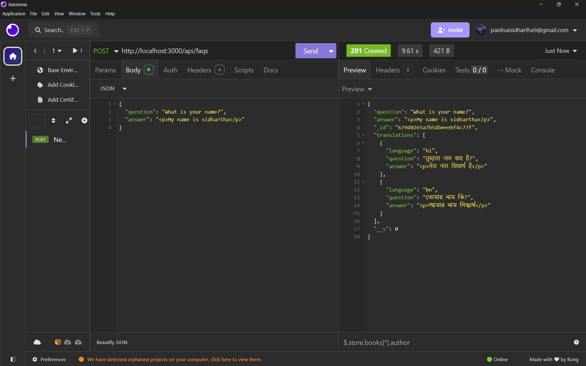

# FAQ Management API 🌐

A backend service for managing FAQs with multilingual support, caching, and an admin panel. Built with Node.js, Express, MongoDB, and Redis.

[](https://nodejs.org/)
[](https://expressjs.com/)
[](https://www.mongodb.com/)
[](https://redis.io/)

## Features ✨

- **Multilingual FAQs**: Supports English, Hindi, Bengali (easily extendable).
- **WYSIWYG Editor**: Rich text formatting for answers (stored as HTML).
- **Caching**: Redis-based caching for improved performance.
- **Admin Panel**: Manage FAQs with auto-translation via AdminJS.
- **Unit Tests**: Mocha/Chai tests for API endpoints.

## Installation 🛠️

### 1. Clone the repository:
```bash
git clone https://github.com/yourusername/faq-backend.git
cd faq-backend
```

### 2. Install dependencies:
```bash
npm install
```

### 3. Environment Setup:
Create a `.env` file:
```env
PORT=3000
MONGODB_URI=mongodb://localhost:27017/faq_db
REDIS_URL=redis://localhost:6379
GOOGLE_API_KEY=your-gemini-api-key
```

### 4. Start Services:
Ensure MongoDB and Redis are running (via Docker or local installation).

### 5. Run the Server:
```bash
npm run dev
```

## API Usage 📡

### Fetch FAQs
```bash
curl http://localhost:3000/api/faqs?lang=hi
```

### Create an FAQ
```bash
curl -X POST http://localhost:3000/api/faqs \  
-H "Content-Type: application/json" \  
-d '{
  "question": "What is Node.js?",
  "answer": "<p>Node.js is a JavaScript runtime.</p>"
}'
```

## Testing 🧪
```bash
npm test
```

## Caching ⚡
- FAQs are cached in Redis for **1 hour**.
- Cache is invalidated on FAQ **creation/update**.

### Docker:
```bash
docker-compose up -d
```

### Heroku/AWS:
- Add Redis and MongoDB add-ons.
- Set environment variables accordingly.





